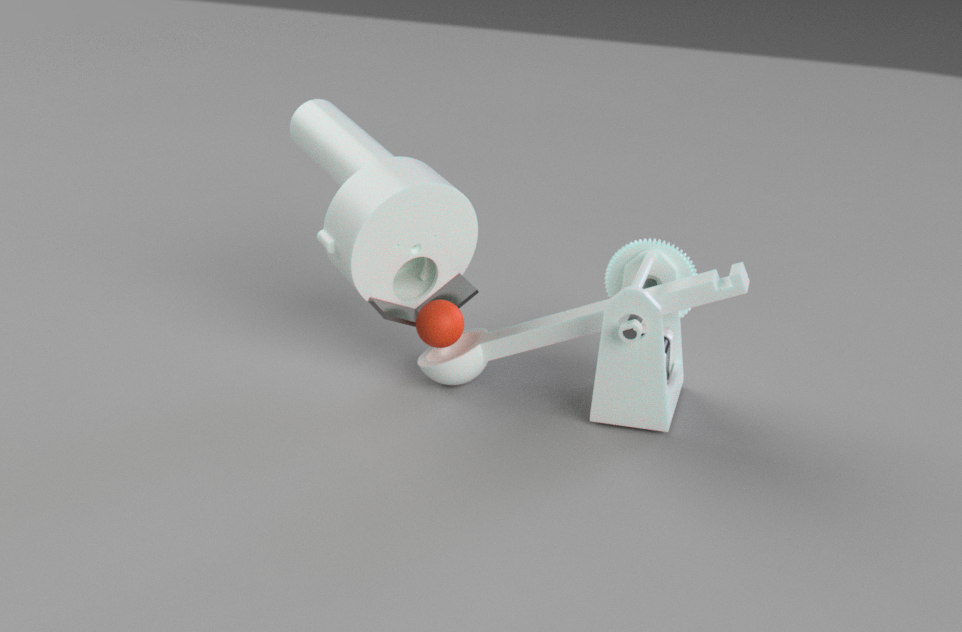

# SillyPult




SillyPult is a local macOS MVP where the catapult is the notification channel:
any detected macOS notification can trigger it. Focus mode is an optional
toggle that switches the helper into work-only notification filtering, and
Chrome distraction handling is layered on top of that focused state.

## Components

- `control-panel/`: Next.js dashboard, settings editor, helper lifecycle UI, test tools
- `helper/`: Swift helper that captures notifications, stores state in SQLite, evaluates rules, and drives the host-side activation flow
- `chrome-extension/`: Chrome MV3 extension that posts active-domain updates to the helper
- `firmware/`: ESP32 catapult controller with WiFi HTTP control

## Local development

Run the control panel:

```bash
npm run dev:panel
```

Run the helper directly:

```bash
npm run dev:helper
```

If the ESP32 is reachable over WiFi, the helper defaults to the firmware mDNS
hostname. Override it only if your network cannot resolve `sillypult.local`:

```bash
export SILLYPULT_FIRMWARE_HOST=sillypult.local
export SILLYPULT_FIRMWARE_PORT=80
export SILLYPULT_FIRMWARE_TIMEOUT_SECONDS=30
```

Set the station-mode WiFi credentials directly in `firmware/src/main.cpp`
before flashing the ESP32.

Helper tests:

```bash
npm run test:helper
```

Control panel lint/build:

```bash
npm run lint:panel
npm run build:panel
```

## Chrome extension

Load `chrome-extension/` as an unpacked extension in Chrome. It reports active
tab domains to `http://127.0.0.1:42424/api/browser-activity`, which the helper
uses for focus-mode distraction events.

## Notes

- Live macOS notification capture is best effort and currently keyed off
  `usernotificationsd` create events in the system log.
- Default behavior is `any notification triggers`.
- Focus mode is a manual toggle in the control panel.
- Test notifications emit a macOS toast and then mirror into the same helper
  rules engine, including the focus filter when active.
- Firmware launches are sent over WiFi as `POST /launch`.
- Completion is tracked by polling `GET /status` until `ready: true`.
- Firmware advertises itself on the local network as `http://sillypult.local/`.
- Helper stdout now emits `[FIRMWARE]` logs when commands are sent to the ESP32,
  when HTTP responses arrive, and while readiness is being polled.
- Local helper data is stored in `~/Library/Application Support/SillyPult/`.

## Contributions

- **Firmware and 3D Modeling:** I wrote the C++ firmware for the ESP32 and designed the 3D models for the physical catapult.

